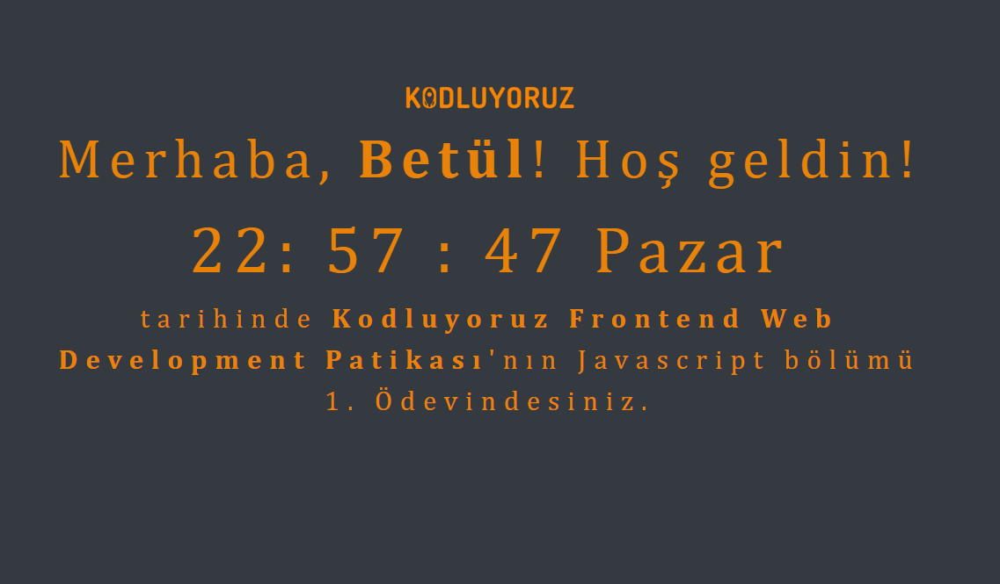

# Js
# Kodluyoruz Javascript Saat Ödevi

Bu proje, Javascript kullanarak dinamik bir saat uygulaması oluşturmaktadır. Proje, kullanıcıya giriş yaptıktan sonra ismi ve mevcut saati ve günü gösterir. Saat, saniye ve gün bilgisi sürekli olarak güncellenir.

## Özellikler

- **Kullanıcı Adı**: Kullanıcı adı girişinden sonra sayfada gösterilir.
- **Dinamik Saat**: Saat, dakika, saniye ve gün bilgisi her saniye güncellenir.
- **Responsive Tasarım**: Bootstrap kullanılarak modern bir görünüm sağlanır.

## Kullanım

1. **Kullanıcı Adı Girişi**: Sayfayı yüklediğinizde kullanıcı adı girmesi istenir. Bu adı sayfada gösterir.
2. **Saat ve Gün Bilgisi**: Saat ve gün bilgisi otomatik olarak güncellenir ve sayfanın üst kısmında gösterilir.

